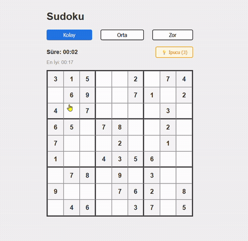

# 🔢 Sudoku Game

A fully-featured Sudoku puzzle game built from scratch with vanilla JavaScript, featuring a backtracking puzzle generator, three difficulty levels, and real-time validation.

## 🎮 Overview

Play classic 9x9 Sudoku directly in your browser. Every puzzle is procedurally generated using a backtracking algorithm, guaranteeing a unique, solvable board each time you play.

## ✨ Features

- **Procedural puzzle generation** — backtracking algorithm generates a fully solved board, then removes cells to create a puzzle
- **Three difficulty levels** — Easy, Medium, and Hard, each with a different number of pre-filled cells
- **Real-time validation** — conflicting numbers are instantly highlighted in red across rows, columns, and 3x3 boxes
- **Hint system** — get up to 3 hints per game, revealing the correct number for a selected cell
- **Timer & best time tracking** — each difficulty level tracks your fastest completion time via localStorage
- **Win detection** — automatically detects when the board is completely and correctly filled
- **Custom start screen** — a clean overlay screen lets you pick a difficulty before the game begins

## 🛠️ Built With

- [Vite](https://vitejs.dev/) — build tool and dev server
- Vanilla JavaScript (no frameworks)
- HTML5 & CSS3

## 🚀 Getting Started

### Prerequisites

- [Node.js](https://nodejs.org/) installed on your machine

### Installation

```bash
# Clone the repository
git clone https://github.com/YOUR_USERNAME/sudoku-game.git

# Navigate into the project folder
cd sudoku-game

# Install dependencies
npm install

# Start the development server
npm run dev
```

Then open the local URL shown in your terminal (usually `http://localhost:5173`).

## 🎮 How to Play

1. Choose a difficulty level (Easy, Medium, or Hard)
2. Click **START** to begin
3. Click any empty cell and type a number (1–9) to fill it in
4. Use **Backspace/Delete** to clear a cell
5. Use the **Hint button** (up to 3 per game) if you're stuck
6. Fill the entire board correctly to win!

## 🧠 How the Puzzle Generator Works

1. A completely empty 9x9 board is created
2. A **backtracking algorithm** fills the board with valid numbers (respecting row, column, and 3x3 box constraints), trying random number orders to ensure variety
3. Once fully solved, a set number of cells are randomly removed based on the selected difficulty, turning the solved board into a playable puzzle

## 📸 Preview



## 🗺️ Roadmap

- [ ] Notes/pencil-marks mode for tracking candidate numbers
- [ ] Undo/redo functionality
- [ ] Keyboard navigation between cells (arrow keys)
- [ ] Mobile-friendly number pad for touch devices
- [ ] Additional puzzle uniqueness guarantee (ensuring only one valid solution)

## 📄 License

This project is open source and available for learning purposes.

## 🙋 About This Project

This game was built as a personal learning project to practice algorithmic thinking (backtracking), DOM manipulation, and state management — all without relying on any external framework or library.